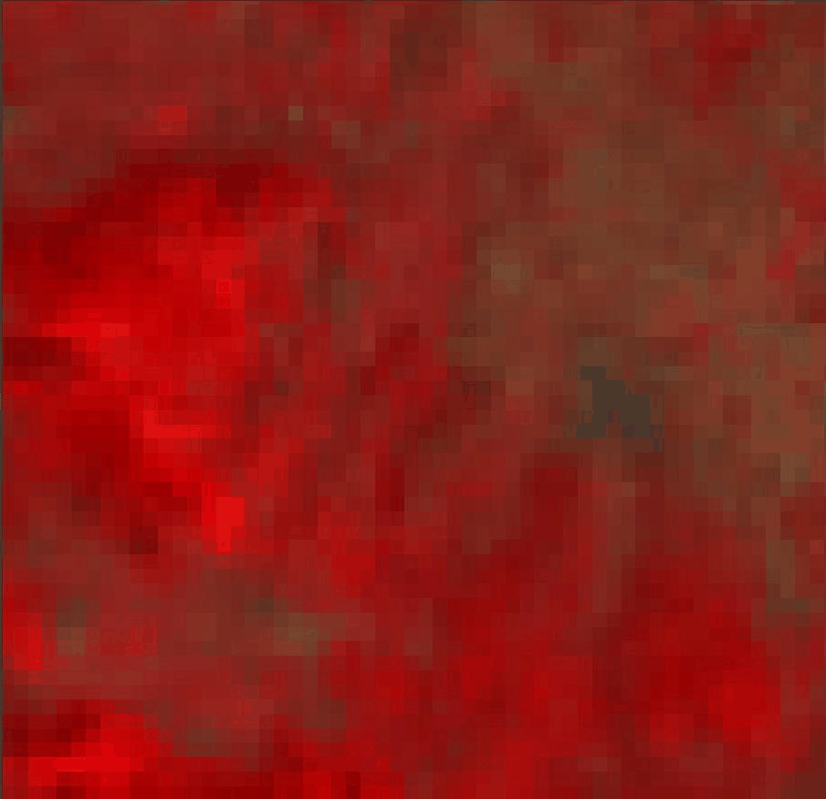

# msi2slstr-training-lightning-implementation
The **public** training environment for the `msi2slstr` model _(pytorch lightning version)_.

## About
### Motivation
The **msi2slstr** project aspires to produce high quality fused data from **Sentinel-2 MSI** and **Sentinel-3 RBT** and **LST**
copernicus products. It started as a passion project to support the author's drive to study data fusion techniques,
for Earth Observation data as much as for other data sources.

### Description
The current training strategy focuses on subtracting the radiometric information of a target image, and attempt to
reconstruct the image correctly by injecting a manually downgraded version of the initial image in the latent space. Curiously,
the exact methods used for radiometry subtraction from the initial image, as well as their intensity, can signify
the legal methods that can be used by the model to reconstruct its radiometry.

### Preview


*Visualization range values are identical in input and derived images*

## Data
Data modules expect a `data` folder in the project's root directory pointing to a dataset generated by
the [`msi2slstr-datagen`](https://github.com/msi2slstr-datagen) scripts.

## Training
### Preparing emissivity estimation module:
Prepare emissivity module to estimate the emissive area of the spectrum using the `emissivity.yaml`
configuration file:
```shell
python msi2slstr-training.py fit --config emissivity.yaml
```
Pretraining this module even briefly would avoid mistargeting during the optimization
process of the main model.

### Pretraining (Optional):
*A pretraining scheme is currently not defined because it is not seen to have any merit for the current training strategy (version 3.x.x).*

### Training:
You can run the main training scheme for the final model using the `training.yaml` configuration file:
```shell
python msi2slstr-training.py fit --config training.yaml
```

## Testing
Run the test command on the `training.yaml` configuration file:
```shell
python msi2slstr-training.py test --config training.yaml
```
This process evaluates the fusion products on the testing portion of the dataset, in terms of energy and topology preservation.

### Prediction
A dataset is set up for prediction which you can invoke using the predict action of the cli along with the
`prediction.yaml` configuration file. A `msi2slstr-datagen`-generated tile folder can be given as an
argument and a fully fused product will be produced in `tif` format to be inspected in a GIS software. 
```shell
python msi2slstr-training.py predict --config prediction.yaml --data.datadir <path-to-msi2slstr-datagen-directory>
```
Data directory in `prediction.yaml` defaults to `data/20230721/T33TVF`.

## Deployment
To deploy a model version to the `msi2slstr` production repo, export an onnx model 
to the `exports` folder using the `onnx-export.py` script and create a **pull request**.
```shell
python scripts/onnx-export.py
```

## Limitations
The emissive region of the spectrum is being modeled according to the relationships
established at the coarse resolution of 1km2 as captured by the **SLSTR sensor**. The assumption that these coarse observations
would apply to the fine spectral signatures of the **urban fabric** is *unjustified* and is only applied for
building the **prototype model**.

If this tool is found promising, it is crucial that finely measured **spectral libraries** be included in the process of **estimating the emissive signatures** of **urban materials** for next versions.
